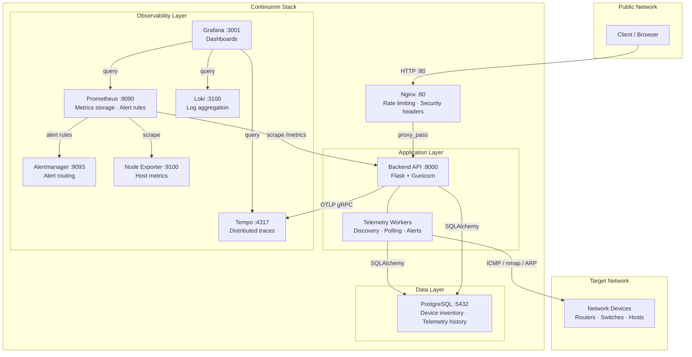
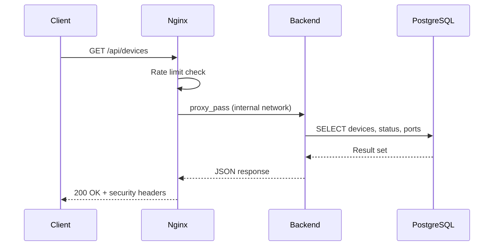
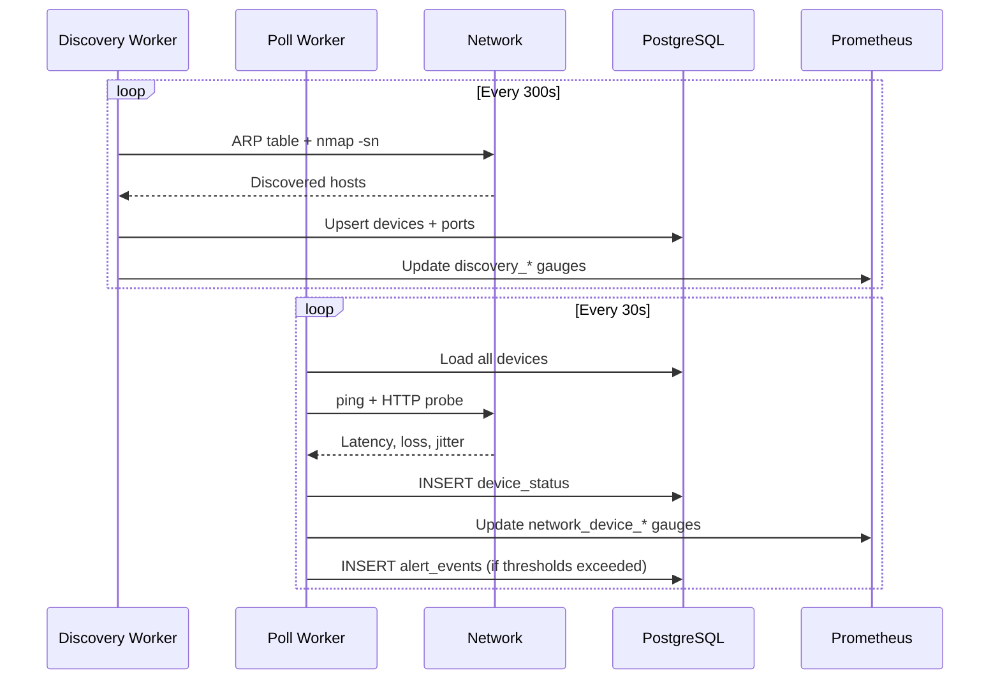
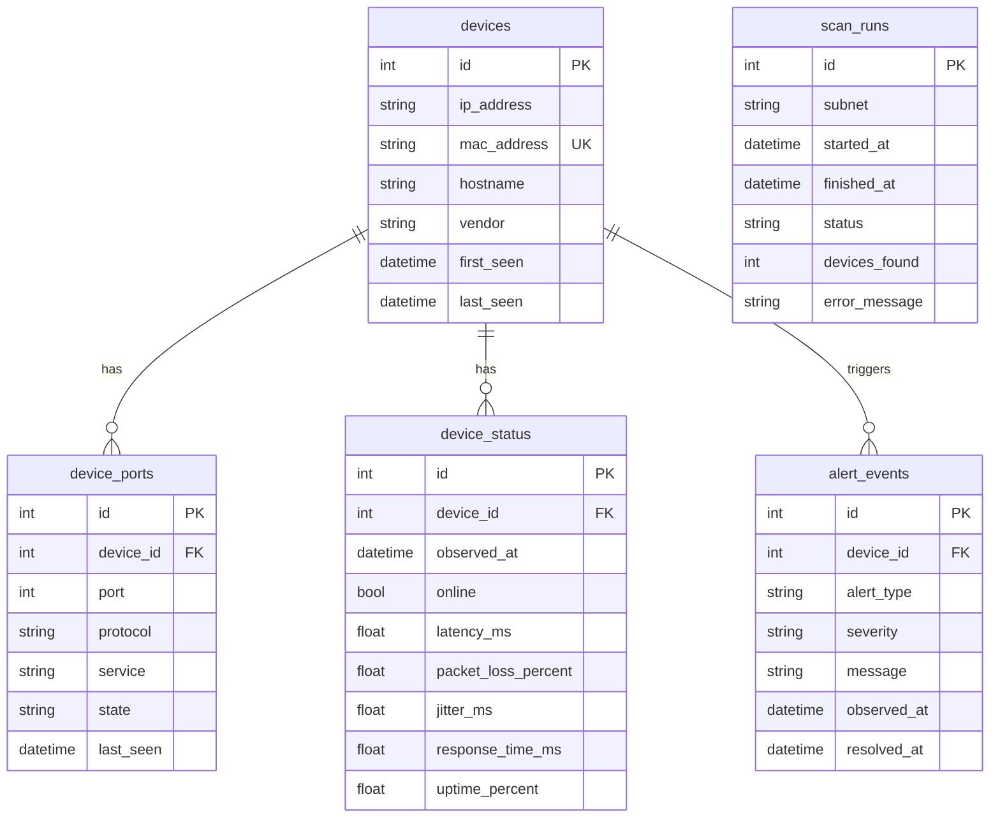
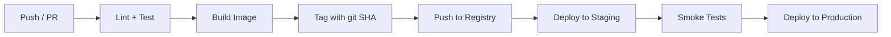

<![CDATA[# Continumm

**Network Telemetry & Observability Platform**

Continumm is a production-grade network monitoring backend that discovers devices on your subnets, polls their health continuously, and exposes the results through a REST API, Prometheus metrics, and pre-built Grafana dashboards. It ships with two deployment paths — Docker Compose for single-node production and Kubernetes manifests for orchestrated environments — plus Terraform IaC for Azure VM provisioning.

---

## Table of Contents

- [Architecture](#architecture)
- [Repository Structure](#repository-structure)
- [Technology Stack](#technology-stack)
- [Quick Start](#quick-start-docker-compose)
- [Kubernetes Deployment](#kubernetes-deployment)
- [Environment Variables](#environment-variables)
- [API Reference](#api-reference)
- [Database Schema](#database-schema)
- [Observability](#observability)
- [Security](#security)
- [Testing](#testing)
- [CI/CD](#cicd)
- [Production Deployment](#production-deployment)
- [Troubleshooting](#troubleshooting)
- [Contributing](#contributing)
- [License](#license)

---

## Architecture

### System Overview



### Request Flow



### Telemetry Data Flow



---

## Repository Structure

```
Continumm/
├── backend/                    # Python backend service
│   ├── app/                    # Application source code
│   │   ├── app.py              # Flask app, API routes, middleware
│   │   ├── config.py           # Environment-driven configuration
│   │   ├── db.py               # SQLAlchemy engine, sessions, leader lock
│   │   ├── models.py           # ORM models (Device, DeviceStatus, etc.)
│   │   └── telemetry/          # Network telemetry subsystem
│   │       ├── service.py      # Orchestrator: discovery + polling loops
│   │       ├── discovery.py    # ARP, scapy, nmap subnet scanning
│   │       ├── monitoring.py   # ICMP ping + HTTP probes
│   │       └── metrics.py      # Prometheus gauge/counter definitions
│   ├── tests/                  # Test directory (scaffold)
│   ├── Dockerfile              # Multi-stage production build
│   ├── requirements.txt        # Pinned Python dependencies
│   ├── build.ps1 / build.sh    # Image build with git SHA tagging
│   ├── verify.ps1              # Local verification checklist
│   └── .env.example            # Backend environment template
│
├── deploy/                     # Deployment configurations
│   ├── docker-compose.yml      # Full stack: 9 services, isolated network
│   ├── deploy.ps1 / deploy.sh  # One-command deploy scripts
│   ├── test.ps1                # Stack verification script
│   ├── reload-nginx.ps1/.sh    # Zero-downtime Nginx reload
│   ├── NGINX.md                # Nginx operations guide
│   ├── nginx/nginx.conf        # Reverse proxy configuration
│   ├── prometheus/             # Scrape config + alert rules
│   ├── grafana/provisioning/   # Datasources + dashboards (auto-loaded)
│   ├── loki/loki.yml           # Log aggregation config
│   ├── tempo/tempo.yml         # Trace storage config
│   ├── alertmanager/           # Alert routing config
│   └── k8s/                    # Kubernetes manifests (Kustomize)
│       ├── kustomization.yaml  # Resource list for kubectl apply -k
│       ├── *-deployment.yaml   # Deployments for all services
│       ├── *-service.yaml      # ClusterIP services
│       ├── ingress.yaml        # Nginx Ingress → continumm.local
│       └── monitoring-operator/# Optional kube-prometheus-stack CRDs
│
├── infra/                      # Infrastructure as Code
│   ├── terraform/              # Azure VM provisioning
│   │   ├── main.tf             # VNet, NSG, VM, disks
│   │   ├── variables.tf        # All configurable parameters
│   │   ├── outputs.tf          # SSH command, IP, connection info
│   │   ├── cloud-init.yaml     # Automated Docker/system setup
│   │   └── terraform.tfvars.example
│   └── ansible/                # Configuration management (placeholder)
│
├── .github/workflows/          # CI/CD pipelines (placeholder)
└── .gitignore
```

| Directory | Purpose |
|-----------|---------|
| `backend/` | Flask API + Gunicorn + telemetry workers |
| `deploy/` | Docker Compose stack, Nginx, monitoring configs, K8s manifests |
| `infra/` | Terraform for Azure VM + cloud-init automation |
| `.github/` | GitHub Actions workflow directory |

---

## Technology Stack

| Layer | Technology | Version | Purpose |
|-------|-----------|---------|---------|
| **Runtime** | Python | 3.11 | Application language |
| **Web Framework** | Flask | 2.3.3 | REST API |
| **WSGI Server** | Gunicorn | 21.2.0 | Production HTTP server (4 workers) |
| **ORM** | SQLAlchemy | 2.0.30 | Database access and schema management |
| **Database** | PostgreSQL | 16 (Alpine) | Device inventory, telemetry history, alerts |
| **Reverse Proxy** | Nginx | 1.25 (Alpine) | Rate limiting, security headers, TLS termination |
| **Metrics** | Prometheus | 2.48.0 | Time-series metrics, alerting rules |
| **Dashboards** | Grafana | latest | Visualization, pre-built dashboards |
| **Logs** | Loki | 2.9.8 | Log aggregation and querying |
| **Traces** | Tempo | 2.4.0 | OpenTelemetry trace storage |
| **Alerts** | Alertmanager | 0.27.0 | Alert deduplication and routing |
| **Host Metrics** | Node Exporter | 1.7.0 | CPU, memory, disk, network metrics |
| **Network Scan** | nmap | OS package | Subnet discovery and port scanning |
| **Packet Craft** | scapy | 2.5.0 | Optional ARP scanning |
| **Tracing SDK** | OpenTelemetry | 1.25.0 | Distributed tracing instrumentation |
| **Containerization** | Docker + Compose | — | Build and orchestration |
| **Orchestration** | Kubernetes + Kustomize | — | Production orchestration |
| **IaC** | Terraform (Azure) | ≥ 1.0 | VM provisioning with cloud-init |

---

## Quick Start (Docker Compose)

### Prerequisites

- Docker and Docker Compose
- Git

### Deploy

**Linux / macOS:**
```bash
cd deploy
chmod +x deploy.sh
./deploy.sh
```

**Windows (PowerShell):**
```powershell
cd deploy
.\deploy.ps1
```

The deploy script: captures git SHA → builds backend image → creates `.env` → starts all 9 services.

### Access Points

| Service | URL | Credentials |
|---------|-----|-------------|
| Application (via Nginx) | http://localhost | — |
| Prometheus | http://localhost:9090 | — |
| Grafana | http://localhost:3001 | `admin` / `changeme` |

### Verify

```bash
curl http://localhost/health
curl http://localhost/metrics
curl http://localhost/version
```

### Enable Telemetry

Edit `deploy/.env` after the first deploy:

```env
TELEMETRY_ENABLED=true
SCAN_SUBNETS=192.168.1.0/24
```

Then restart: `docker-compose down && docker-compose up -d`

---

## Kubernetes Deployment

### Prerequisites

- Kubernetes cluster (kind, minikube, or managed)
- Nginx Ingress Controller installed
- Backend image available to the cluster

### Build and Load Image

```bash
docker build -t continumm-backend:latest ./backend

# kind
kind load docker-image continumm-backend:latest

# minikube
minikube image load continumm-backend:latest
```

### Apply Manifests

```bash
kubectl apply -k deploy/k8s
```

All resources deploy into the `continumm` namespace via Kustomize.

### Access

| Service | Method |
|---------|--------|
| App | `http://continumm.local` (add to `/etc/hosts`) |
| Prometheus | `kubectl -n continumm port-forward svc/prometheus 9090:9090` |
| Grafana | `kubectl -n continumm port-forward svc/continumm-grafana 3000:3000` |

### Telemetry in K8s

Edit `deploy/k8s/telemetry-configmap.yaml` with your target subnets before applying. The `backend-telemetry-deployment.yaml` runs a separate telemetry-only pod with leader election via PostgreSQL advisory locks.

---

## Environment Variables

### Backend Application

| Variable | Purpose | Default | Required |
|----------|---------|---------|----------|
| `PORT` | HTTP listen port | `8000` | No |
| `HOST` | Bind address | `0.0.0.0` | No |
| `ENVIRONMENT` | Environment label (development/production) | `development` | No |
| `LOG_LEVEL` | Python log level | `INFO` | No |
| `DATABASE_URL` | PostgreSQL connection string | _(empty)_ | Yes (for telemetry) |
| `GIT_COMMIT` | Git SHA for `/version` endpoint | `unknown` | No (set at build) |

### Telemetry

| Variable | Purpose | Default | Required |
|----------|---------|---------|----------|
| `TELEMETRY_ENABLED` | Enable discovery + polling workers | `false` | No |
| `TELEMETRY_DISABLE_LEADER_LOCK` | Skip PostgreSQL advisory lock | `false` | No |
| `TELEMETRY_LEADER_LOCK_KEY` | Advisory lock key | `42004200` | No |
| `SCAN_SUBNETS` | Comma-separated CIDR list | _(empty)_ | Yes (if telemetry on) |
| `DISCOVERY_INTERVAL_SECONDS` | Seconds between discovery scans | `300` | No |
| `POLL_INTERVAL_SECONDS` | Seconds between health polls | `30` | No |

### Scanning

| Variable | Purpose | Default | Required |
|----------|---------|---------|----------|
| `SCAN_USE_ARP` | Read `/proc/net/arp` | `true` | No |
| `SCAN_USE_SCAPY` | Use scapy ARP scan | `false` | No |
| `SCAN_USE_NMAP` | Use nmap host discovery | `true` | No |
| `PORT_SCAN_ENABLED` | Enable nmap port scanning | `false` | No |
| `PORT_SCAN_TOP_PORTS` | nmap `--top-ports` count | `50` | No |
| `PORT_SCAN_LIMIT` | Max concurrent port scans | `25` | No |
| `NMAP_PATH` | Path to nmap binary | `nmap` | No |
| `NMAP_MIN_RATE` | nmap `--min-rate` | _(empty)_ | No |
| `NMAP_MAX_RATE` | nmap `--max-rate` | _(empty)_ | No |
| `NMAP_DISABLE_ARP_PING` | Use ICMP echo instead of ARP | `false` | No |

### Health Polling

| Variable | Purpose | Default | Required |
|----------|---------|---------|----------|
| `PING_COUNT` | ICMP packets per probe | `3` | No |
| `PING_TIMEOUT_SECONDS` | Ping timeout | `1` | No |
| `MAX_CONCURRENT_PINGS` | Concurrent ping semaphore | `50` | No |
| `HTTP_PROBE_ENABLED` | Enable HTTP probing | `false` | No |
| `HTTP_PROBE_TIMEOUT_SECONDS` | HTTP probe timeout | `2.0` | No |

### Alerting Thresholds

| Variable | Purpose | Default | Required |
|----------|---------|---------|----------|
| `ALERT_OFFLINE_AFTER` | Consecutive offline polls before alert | `3` | No |
| `ALERT_LATENCY_MS` | Latency threshold (ms) | `200` | No |
| `ALERT_PACKET_LOSS_PERCENT` | Packet loss threshold (%) | `20` | No |
| `ALERT_COOLDOWN_SECONDS` | Min seconds between duplicate alerts | `300` | No |

### OpenTelemetry

| Variable | Purpose | Default | Required |
|----------|---------|---------|----------|
| `OTEL_ENABLED` | Enable distributed tracing | `false` | No |
| `OTEL_SERVICE_NAME` | Service name in traces | `continumm-backend` | No |
| `OTEL_EXPORTER_OTLP_ENDPOINT` | OTLP gRPC endpoint | _(empty)_ | Yes (if OTEL on) |

### Deploy Stack (deploy/.env)

| Variable | Purpose | Default |
|----------|---------|---------|
| `GIT_COMMIT` | Passed to backend build | `unknown` |
| `GRAFANA_ADMIN_PASSWORD` | Grafana admin password | `changeme` |
| `POSTGRES_USER` | PostgreSQL username | `continumm` |
| `POSTGRES_PASSWORD` | PostgreSQL password | `continumm` |
| `POSTGRES_DB` | PostgreSQL database name | `continumm` |

---

## API Reference

All endpoints are served behind Nginx at port 80. Rate limit: **10 req/s** per IP with burst of 20.

### Operational Endpoints

#### `GET /health`
Returns dependency health. Load balancers and orchestrators should poll this.

```json
{
  "status": "healthy",
  "timestamp": "2026-01-15T12:00:00.000000Z",
  "checks": {
    "application": "healthy",
    "database": "healthy",
    "telemetry": "enabled"
  }
}
```
**Status codes:** `200` healthy, `503` unhealthy.

#### `GET /metrics`
Prometheus scrape endpoint. Returns `text/plain` with all application and telemetry metrics.

#### `GET /version`
```json
{
  "version": "a1b2c3d...",
  "commit": "a1b2c3d...",
  "environment": "production",
  "timestamp": "2026-01-15T12:00:00.000000Z"
}
```

#### `GET /`
Service info with available endpoint list.

### Telemetry API

#### `GET /api/devices?limit=200`
List discovered devices with latest status and open ports.

#### `GET /api/devices/<id>`
Single device detail with full port list and last status snapshot.

#### `GET /api/devices/<id>/metrics?limit=100`
Time-series telemetry data for a device (latency, loss, jitter, uptime).

#### `GET /api/alerts?limit=100`
Alert feed ordered by most recent. Includes `device_offline`, `latency_spike`, `packet_loss` types.

#### `GET /api/telemetry/overview`
Summary: total device count, last scan result, last alert.

---

## Database Schema

PostgreSQL 16 with SQLAlchemy ORM. Tables are auto-created on first startup via `Base.metadata.create_all()`.



---

## Observability

### Metrics (Prometheus)

**Application metrics** (scraped from `/metrics`):
- `request_total{method, endpoint, status}` — Request counter
- `request_duration_seconds_bucket{method, endpoint}` — Latency histogram
- `error_total{method, endpoint, error_type}` — Error counter

**Telemetry metrics:**
- `network_device_online{ip, device_id}` — Online status gauge
- `network_device_latency_ms{ip, device_id}` — Latency gauge
- `network_device_packet_loss_percent{ip, device_id}` — Packet loss gauge
- `network_device_jitter_ms{ip, device_id}` — Jitter gauge
- `discovery_scan_duration_seconds{subnet}` — Scan timing histogram
- `discovery_active_devices` — Total active device count
- `network_alerts_total{alert_type, severity}` — Alert counter

**Alert rules** (in `deploy/prometheus/alert_rules.yml`):
- `NetworkDeviceOffline` — Device offline for 2m (critical)
- `NetworkLatencyHigh` — Latency >200ms for 5m (warning)
- `NetworkPacketLossHigh` — Loss >20% for 5m (warning)
- `NetworkDeviceFlapping` — >4 state changes in 10m (warning)

### Logging (Loki)

Structured JSON logs emitted to stdout, collected by Docker log driver, queryable in Grafana via Loki datasource.

Log fields: `timestamp`, `level`, `message`, `logger`, `request_id`, `path`, `method`, `status_code`, `duration`, `trace_id`, `span_id`.

### Tracing (Tempo)

OpenTelemetry instrumentation on Flask. Traces are exported via OTLP gRPC to Tempo and correlated with logs via `trace_id`.

### Dashboards (Grafana)

Two pre-provisioned dashboards:
1. **Continumm Backend** — RPS, p50/p95/p99 latency, error rate, CPU, memory
2. **Continumm Network** — Device online status, latency, packet loss, discovery metrics

---

## Security

### Network Isolation (Docker Compose)
- Backend has **no host port binding** — accessible only via internal Docker network
- Prometheus and Grafana bind to `127.0.0.1` only
- Only Nginx exposes port 80 to the host
- All services communicate on an isolated bridge network (`172.30.0.0/16`)

### Nginx Hardening
- Rate limiting: 10 req/s per IP, burst 20
- Security headers: `X-Frame-Options`, `X-Content-Type-Options`, `X-XSS-Protection`, `Referrer-Policy`
- `nginx_status` restricted to internal network (`172.16.0.0/12`)

### Container Security
- Non-root user (`appuser`, UID 1000) in the backend container
- Multi-stage Docker build minimizes attack surface
- Explicit capability grants for `ping` and `nmap` (`cap_net_raw`)

### Infrastructure Security (Terraform)
- SSH key-only authentication (no passwords)
- NSG with explicit deny-all default
- SSH restricted to configurable IP allowlist
- UFW firewall enabled via cloud-init
- Automatic security updates (`unattended-upgrades`)

### Secrets Management
- All secrets via environment variables (12-factor)
- `.env` files excluded from git via `.gitignore`
- K8s secrets for PostgreSQL credentials and SNMP community strings

---

## Testing

### Stack Verification

```powershell
cd deploy
.\test.ps1    # Checks all services, endpoints, isolation, Prometheus targets
```

### Backend Verification

```powershell
cd backend
.\verify.ps1  # File checks + implementation checklist
```

### Manual Endpoint Testing

```bash
curl http://localhost/health          # Health check
curl http://localhost/version         # Git commit
curl http://localhost/metrics         # Prometheus metrics
curl http://localhost/api/devices     # Device list (requires DB + telemetry)
curl http://localhost/api/alerts      # Alert feed
```

### Load Testing

```powershell
for ($i=0; $i -lt 100; $i++) {
    curl http://localhost/health
    Start-Sleep -Milliseconds 100
}
```

---

## CI/CD

The `.github/workflows/` directory is scaffolded for GitHub Actions. Recommended pipeline:



**Image tagging strategy:** Every image is tagged with its git short SHA (`continumm-backend:a1b2c3d`) for immutable, traceable deployments. A `latest` convenience tag is also applied.

---

## Production Deployment

### Azure VM (Terraform)

```powershell
cd infra/terraform
cp terraform.tfvars.example terraform.tfvars
# Edit terraform.tfvars: set ssh_public_key, restrict allowed_ssh_ips
terraform init
terraform plan
terraform apply
```

Terraform provisions: Resource Group → VNet → NSG → Public IP → Ubuntu 22.04 VM → Data Disk. Cloud-init auto-installs Docker, Compose, system tools, firewall, and performance tuning.

Post-provision:
```bash
ssh continumm@<VM-IP>
cloud-init status --wait
cd /opt/continumm && git clone <repo-url> .
cd deploy && ./deploy.sh
```

### Scaling Considerations

- **Horizontal API scaling:** Run multiple backend replicas behind Nginx with `least_conn`
- **Telemetry singleton:** Uses PostgreSQL advisory locks to ensure only one telemetry worker runs
- **Database:** Add connection pooling (PgBouncer) and read replicas for high device counts
- **Metrics retention:** Prometheus retains 30 days; adjust via `--storage.tsdb.retention.time`

### Zero-Downtime Deploys

```powershell
cd deploy
.\reload-nginx.ps1   # Validates config, graceful reload, no dropped connections
```

---

## Troubleshooting

| Problem | Diagnosis | Solution |
|---------|-----------|---------|
| Can't reach `localhost:8000` | Backend is intentionally not exposed | Access via `http://localhost/` (Nginx) |
| 502 Bad Gateway | Backend container unhealthy | `docker-compose logs backend` |
| Grafana dashboard empty | No scrape data yet | Generate traffic, wait 30s for scrape |
| Prometheus target DOWN | Service not running or network issue | `docker-compose exec prometheus wget -O- http://backend:8000/health` |
| Port 80 already in use | Another process on port 80 | `netstat -ano \| findstr :80` |
| Telemetry not discovering | `TELEMETRY_ENABLED=false` or no subnets | Set `TELEMETRY_ENABLED=true` and `SCAN_SUBNETS` |
| Database errors on API calls | `DATABASE_URL` not set or DB unreachable | Check `docker-compose ps postgres` and connection string |
| nmap not found in container | Binary missing from image | Verify Dockerfile installs nmap |

### Full Reset

```bash
cd deploy
docker-compose down -v   # Stops all containers AND deletes volumes
docker-compose up -d     # Fresh start
```

---

## Contributing

### Branch Naming

- `feature/<description>` — New features
- `fix/<description>` — Bug fixes
- `docs/<description>` — Documentation updates
- `infra/<description>` — Infrastructure changes

### Commit Conventions

Follow [Conventional Commits](https://www.conventionalcommits.org/):
```
feat(telemetry): add HTTP probe support
fix(api): handle null mac_address in device list
docs(readme): update environment variable table
```

### PR Workflow

1. Fork / branch from `main`
2. Make changes with tests
3. Ensure `verify.ps1` and `test.ps1` pass
4. Open PR with description of changes
5. Address review feedback
6. Squash merge to `main`

### Code Standards

- Python: follow PEP 8, use type hints where practical
- Config: environment variables only, no config files
- Logging: structured JSON, never `print()`
- Docker: multi-stage builds, non-root user, explicit `EXPOSE`

---

## Documentation Index

| Document | Description |
|----------|-------------|
| [backend/README.md](backend/README.md) | Backend service, API, containerization |
| [deploy/README.md](deploy/README.md) | Docker Compose stack operations |
| [deploy/NGINX.md](deploy/NGINX.md) | Nginx zero-downtime operations guide |
| [deploy/k8s/README.md](deploy/k8s/README.md) | Kubernetes deployment guide |
| [infra/terraform/README.md](infra/terraform/README.md) | Azure VM provisioning with Terraform |
| [docs/architecture.md](docs/architecture.md) | Detailed architecture documentation |
| [docs/operations.md](docs/operations.md) | Operational runbook |

---

## License

MIT
]]>