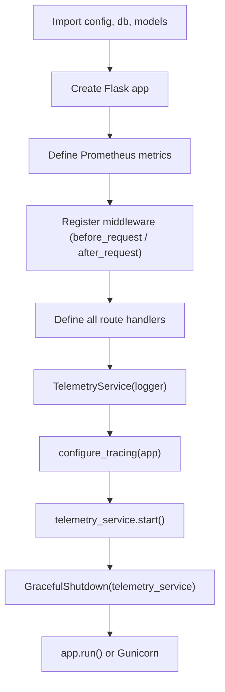

# Backend Application Internals

This directory contains the Flask application source code, telemetry workers, database layer, and configuration.

---

## Module Map

| File | Purpose |
|------|---------|
| `app.py` | Flask application factory, all API routes, request middleware (metrics + logging), OpenTelemetry setup, graceful shutdown handler |
| `config.py` | `Config` class reading all settings from environment variables. Singleton exported as `config`. |
| `db.py` | SQLAlchemy engine initialization with connection pooling, `get_session()` context manager, `init_db()` schema creation, `try_acquire_leader_lock()` for telemetry election |
| `models.py` | SQLAlchemy ORM models: `Device`, `DevicePort`, `DeviceStatus`, `AlertEvent`, `ScanRun` |
| `telemetry/` | Network telemetry subsystem (see [telemetry/README.md](telemetry/README.md)) |

---

## Startup Sequence



## Middleware Pipeline

Every request passes through:

1. **`before_request`** — Records start time, generates random `request_id`
2. **Route handler** — Business logic
3. **`after_request`** — Increments `request_total` counter, observes `request_duration_seconds` histogram, increments `error_total` if status ≥ 400, emits structured JSON log with `request_id`, `path`, `method`, `status_code`, `duration`, and optional `trace_id`/`span_id`

## Database Session Pattern

All database access uses the `get_session()` context manager:

```python
with get_session() as session:
    devices = session.query(Device).all()
    # auto-commits on exit, rolls back on exception
```

This ensures every transaction is committed or rolled back, and the session is always closed.

