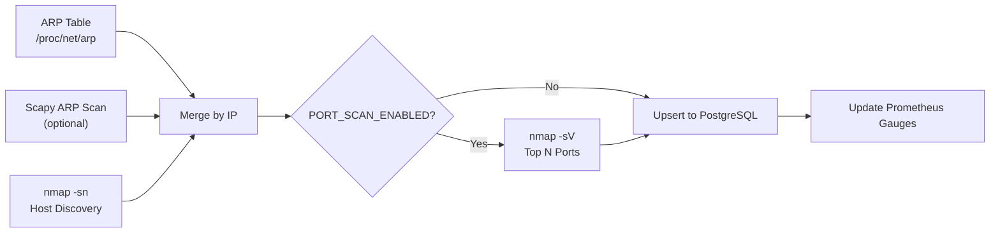
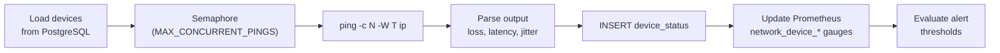

<![CDATA[# Telemetry Subsystem

Automated network discovery and device health monitoring. Discovers devices on configured subnets, polls their health continuously, stores results in PostgreSQL, and exports metrics to Prometheus.

---

## Module Map

| File | Purpose |
|------|---------|
| `service.py` | `TelemetryService` — Main orchestrator. Runs in a daemon thread with `asyncio`. Manages discovery loop, polling loop, device persistence, alert evaluation, and leader election. |
| `discovery.py` | Network discovery: ARP table parser, scapy ARP scan, nmap host discovery (`-sn`), nmap port scan (`-sV`), result merging and port enrichment. |
| `monitoring.py` | Device probing: ICMP `ping` output parser, async `ping_host()`, HTTP probe via `aiohttp`. |
| `metrics.py` | Prometheus metric definitions: 15 gauges/counters/histograms for discovery, polling, and per-device telemetry. |

---

## Discovery Pipeline



**Merge strategy:** Devices from all sources are merged by IP address. nmap data (hostname, vendor) overwrites ARP-only data.

---

## Polling Pipeline



---

## Prometheus Metrics

### Discovery Metrics
| Metric | Type | Labels | Description |
|--------|------|--------|-------------|
| `discovery_scan_duration_seconds` | Histogram | `subnet` | Time to complete a discovery scan |
| `discovery_scan_failures_total` | Counter | `subnet` | Failed discovery scans |
| `discovery_devices_found` | Gauge | `subnet` | Devices found in last scan |
| `discovery_active_devices` | Gauge | — | Total active devices across all subnets |

### Polling Metrics
| Metric | Type | Labels | Description |
|--------|------|--------|-------------|
| `polling_run_duration_seconds` | Histogram | — | Time to complete a polling run |
| `polling_failures_total` | Counter | — | Failed polling runs |
| `polling_queue_depth` | Gauge | — | Number of devices queued for polling |
| `worker_last_run_timestamp` | Gauge | `worker` | Unix timestamp of last worker execution |

### Per-Device Metrics
| Metric | Type | Labels | Description |
|--------|------|--------|-------------|
| `network_device_online` | Gauge | `ip`, `device_id` | 1 if online, 0 if offline |
| `network_device_latency_ms` | Gauge | `ip`, `device_id` | Average round-trip latency |
| `network_device_packet_loss_percent` | Gauge | `ip`, `device_id` | Packet loss percentage |
| `network_device_jitter_ms` | Gauge | `ip`, `device_id` | Jitter (mdev) in ms |
| `network_device_response_time_ms` | Gauge | `ip`, `device_id` | Response time in ms |
| `network_device_uptime_percent` | Gauge | `ip`, `device_id` | Rolling 100-sample uptime |
| `network_device_open_port` | Gauge | `ip`, `port`, `service` | 1 if port open, 0 if closed |
| `network_device_info` | Gauge | `ip`, `device_id`, `hostname`, `mac_address`, `vendor` | Device inventory label set |
| `network_alerts_total` | Counter | `alert_type`, `severity` | Total alerts emitted |

---

## Leader Election

In multi-replica deployments, only one instance should run discovery and polling. The service uses PostgreSQL advisory locks:

```python
SELECT pg_try_advisory_lock(42004200)
```

- Returns `true` → this instance becomes the telemetry leader
- Returns `false` → this instance skips telemetry (API-only mode)
- Lock is released on shutdown or connection close
- Configurable via `TELEMETRY_LEADER_LOCK_KEY`
- Disable with `TELEMETRY_DISABLE_LEADER_LOCK=true` for single-instance deployments

---

## Configuration

All settings come from `config.py`. Key telemetry variables:

- `TELEMETRY_ENABLED` — Master switch
- `SCAN_SUBNETS` — Comma-separated CIDR list
- `DISCOVERY_INTERVAL_SECONDS` — Discovery loop interval (default: 300s)
- `POLL_INTERVAL_SECONDS` — Polling loop interval (default: 30s)
- `MAX_CONCURRENT_PINGS` — Async semaphore bound (default: 50)
]]>
