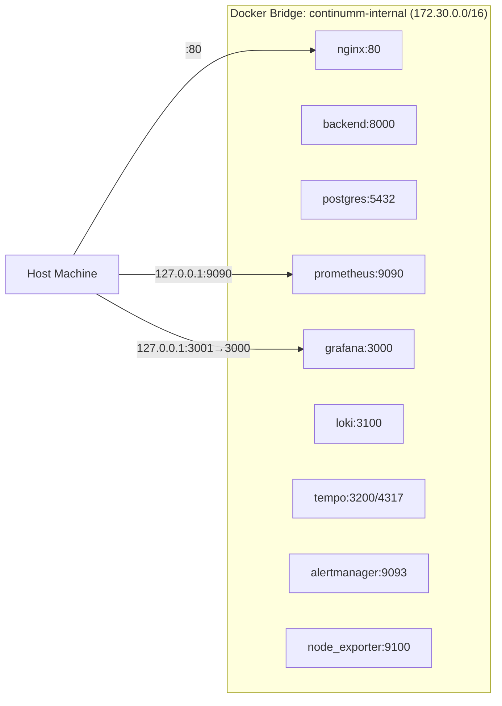
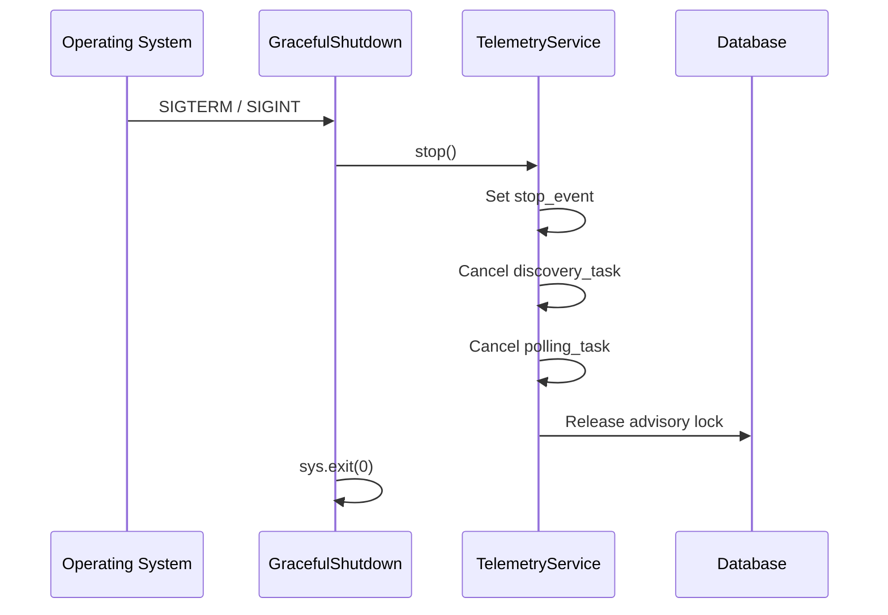
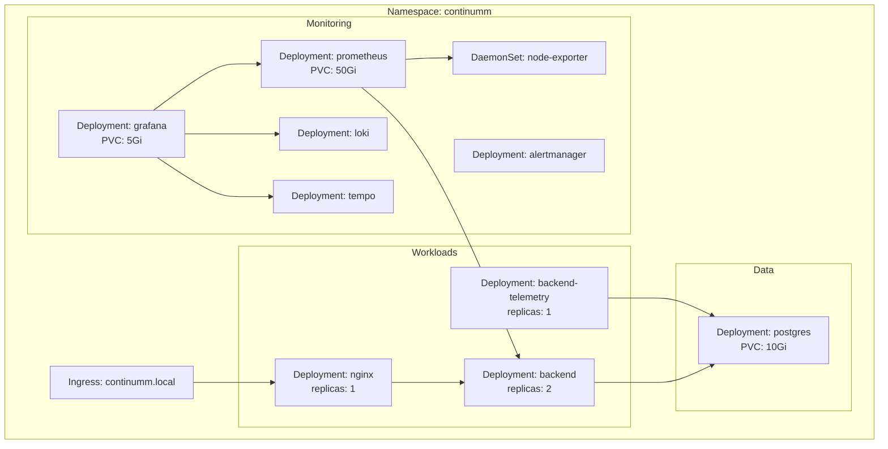
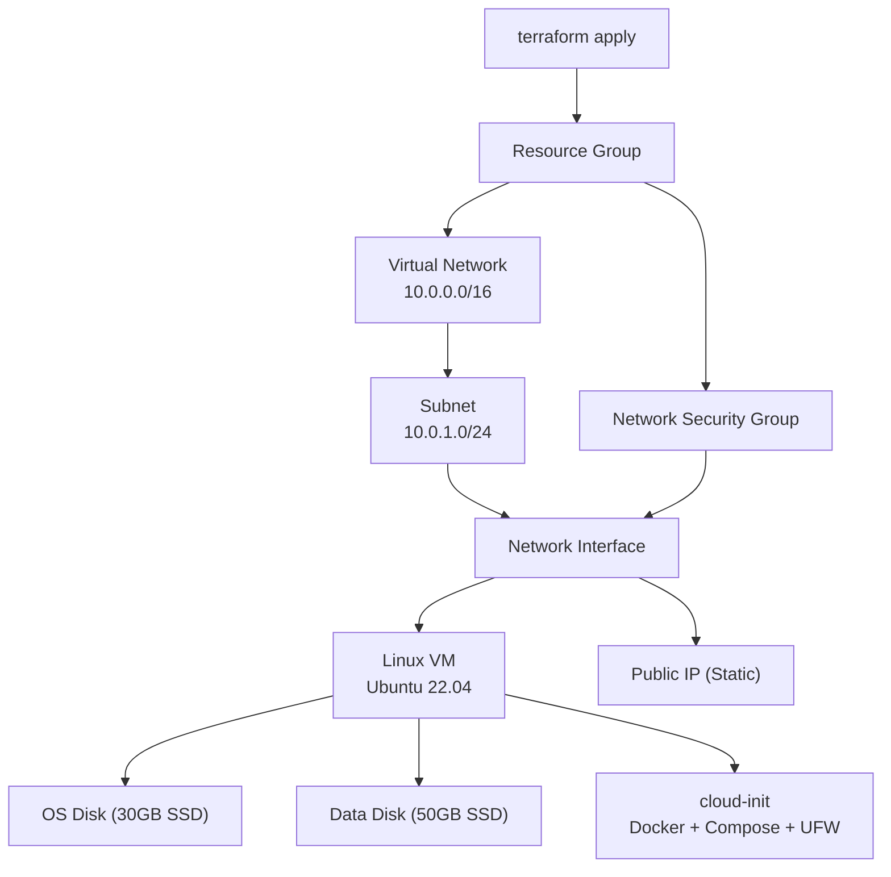

<![CDATA[# Continumm — Architecture Documentation

This document provides a deep-dive into the design, data flows, and component interactions that make up the Continumm platform.

---

## Design Philosophy

Continumm follows the **12-factor app** methodology:

1. **Codebase** — Single repo tracked in Git.
2. **Dependencies** — Pinned in `requirements.txt`.
3. **Config** — All settings via environment variables. Zero config files at runtime.
4. **Backing services** — PostgreSQL is an attached resource swapped by changing `DATABASE_URL`.
5. **Build, release, run** — Immutable Docker images tagged with git SHA.
6. **Processes** — Stateless API processes behind Gunicorn. Telemetry state lives in PostgreSQL.
7. **Port binding** — Gunicorn self-hosts on port 8000.
8. **Concurrency** — 4 Gunicorn workers. Telemetry uses asyncio with configurable concurrency.
9. **Disposability** — Signal handlers for graceful shutdown. Advisory-lock-based leader election.
10. **Dev/prod parity** — Docker Compose mirrors production topology.
11. **Logs** — Structured JSON to stdout, aggregated by Loki.
12. **Admin processes** — No special admin tooling; all state managed via API and DB.

---

## Component Architecture

### Backend Application

```
app.py                    → Flask app factory, middleware, API routes
  ├── config.py           → Config singleton (reads env vars once)
  ├── db.py               → SQLAlchemy engine, session management, leader lock
  ├── models.py           → ORM: Device, DevicePort, DeviceStatus, AlertEvent, ScanRun
  └── telemetry/
      ├── service.py      → TelemetryService: threaded async orchestrator
      ├── discovery.py    → ARP, scapy, nmap discovery + port enrichment
      ├── monitoring.py   → ICMP ping + HTTP probes
      └── metrics.py      → Prometheus gauge/counter/histogram definitions
```

**Key design decisions:**

- **Single-process telemetry with leader election:** In multi-replica Kubernetes deployments, only one pod should run discovery/polling. PostgreSQL advisory locks (`pg_try_advisory_lock`) provide leader election without external coordination services.
- **Async telemetry, sync API:** The API routes are synchronous Flask. Telemetry workers run in a dedicated thread with `asyncio.run()`, enabling concurrent subnet scans and device pings via `asyncio.Semaphore`.
- **Metric-first alerting:** Thresholds are evaluated in-process during each poll cycle. Alerts are both stored in PostgreSQL (for the API) and incremented in Prometheus counters (for Alertmanager rules).

### Network Topology



- **Only Nginx is publicly reachable.** The backend, database, and all observability services are internal-only.
- Prometheus and Grafana bind to `127.0.0.1` for local debugging access, but are not routable from external networks.

### Connection Pooling

SQLAlchemy engine settings:
- `pool_pre_ping=True` — validates connections before use
- `pool_size=5` — maintains 5 persistent connections
- `max_overflow=10` — allows up to 15 total connections under load

### Graceful Shutdown



---

## Data Lifecycle

### Device Discovery

1. **ARP table** (`/proc/net/arp`) — instant, zero network traffic, Linux only.
2. **Scapy ARP scan** — active L2 probe, optional, requires `cap_net_raw`.
3. **nmap host discovery** (`nmap -sn -oX -`) — ICMP/ARP hybrid, most reliable.
4. Results are **merged by IP address**. nmap data enriches ARP data (adds hostname, vendor).
5. If `PORT_SCAN_ENABLED`, nmap service scan enriches each device with open port data.
6. Devices are upserted into PostgreSQL (matched by MAC first, then IP).

### Health Polling

1. Every `POLL_INTERVAL_SECONDS`, all known devices are loaded from PostgreSQL.
2. Each device is pinged concurrently (bounded by `MAX_CONCURRENT_PINGS`).
3. Ping output is parsed for: `packet_loss`, `latency_ms`, `jitter_ms`.
4. Results are written to `device_status` and exposed as Prometheus gauges.
5. Uptime is computed as a rolling average over the last 100 observations.

### Alert Evaluation

Alerts are emitted when:
- **Device offline** for `ALERT_OFFLINE_AFTER` consecutive polls → `critical`
- **Latency** exceeds `ALERT_LATENCY_MS` → `warning`
- **Packet loss** exceeds `ALERT_PACKET_LOSS_PERCENT` → `warning`

A cooldown (`ALERT_COOLDOWN_SECONDS`, default 300s) prevents duplicate alerts for the same device and type.

---

## Kubernetes Architecture



The K8s deployment separates API replicas from the telemetry worker. The telemetry deployment runs a single replica that acquires the PostgreSQL advisory lock on startup — additional replicas will detect the lock and remain idle, providing automatic failover.

---

## Infrastructure (Terraform)



The VM is fully bootstrapped by cloud-init: Docker installed, firewall configured, kernel tuned, application directories created. After provisioning, deploying is `git clone` + `./deploy.sh`.
]]>
