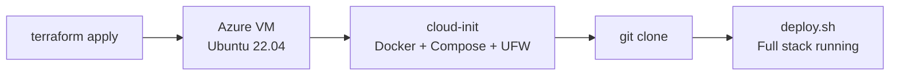

# Continumm Infrastructure

Infrastructure as Code for provisioning and configuring production environments.

## Components

| Directory | Tool | Purpose |
|-----------|------|---------|
| `terraform/` | Terraform (Azure) | Provisions VM, networking, storage, and security groups |
| `ansible/` | Ansible | Configuration management (placeholder for future use) |

## Deployment Flow



### 1. Provision Infrastructure

```bash
cd infra/terraform
cp terraform.tfvars.example terraform.tfvars
# Edit: set ssh_public_key, restrict allowed_ssh_ips
terraform init && terraform apply
```

### 2. Deploy Application

```bash
ssh continumm@<VM-IP>
cloud-init status --wait
cd /opt/continumm
git clone <repo-url> .
cd deploy && ./deploy.sh
```

### 3. Access

```
http://<VM-IP>          # Application
http://<VM-IP>:9090     # Prometheus
http://<VM-IP>:3000     # Grafana
```

## Security

- SSH key-only authentication
- NSG with deny-all default + explicit allow rules
- UFW firewall on the VM
- Automatic security updates via unattended-upgrades

See [terraform/README.md](terraform/README.md) for detailed configuration and variables.

